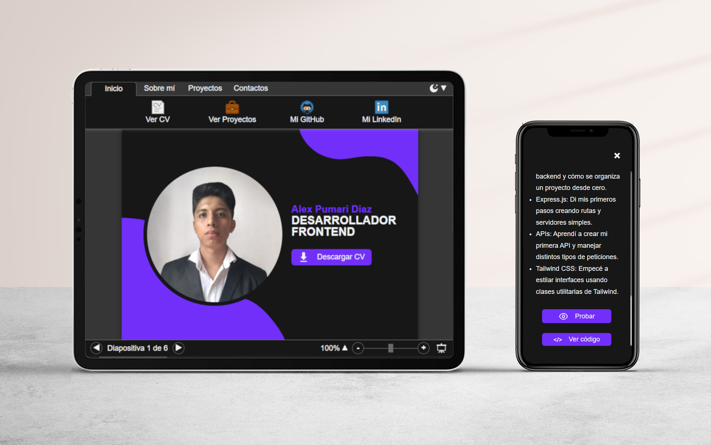

# 📋 Portafolio web personal




Un portafolio interactivo con una interfaz de usuario inspirada en PowerPoint. Desarrollado con HTML, Sass para estilos, JavaScript para la lógica y React para la estructura dinámica.

  <div align="center">
    <a href="https://youtu.be/RaP0u8aqNzc" target="_blank">
      
    </a>
    <a href="https://www.alexpumaridev.com.ar/" target="_blank">
      
    </a>
  </div>  
  <br>

  📚 Cosas que aprendí
- Bases de React: Me introduje en la creación de componentes y el uso de JSX. Aprendí a manejar estado y props para construir interfaces dinámicas.
- Preprocesador de CSS: Usé Sass para organizar estilos de forma más eficiente. Apliqué variables, anidación y mixins para evitar repetición.
- Estilos en proyectos: Me di cuenta de que, aunque Sass agiliza el trabajo, no es suficiente para proyectos más complejos. Necesito probar otros métodos más escalables y modernos.
---

## 📁 Estructura del Proyecto

```
react-portfolio/
├── 📁 public/                  
│   └── 📁 favicons/             # Conjunto de Favicons
├── 📁 src/
│   ├── 📁 adapters/             # Adaptadores de información
│   ├── 📁 assets/               # Imagenes y PDFs
│   ├── 📁 components/           # Componentes de React
│   ├── 📁 config/               # Ajustes y constantes
│   ├── 📁 contexts/             # Contextos de React
│   ├── 📁 hooks/                # Customs Hooks de React
│   ├── 📁 logic/                # Lógica de negocio
│   ├── 📁 services/             # Servicios de datos
│   ├── 📁 styles/               # Estilos y configuraciones del mismo
│   ├── app.jsx 
│   └── main.jsx 
└── README.md
```

---

## 🚀 Instalación

### Requisitos previos
- Node.js 18+ 
- npm or yarn

### 1. Clonar este repositorio
```bash
git clone https://github.com/AlexRubenPumari/react-portfolio.git
cd react-portfolio
```

### 2. Instalar dependencias
```bash
npm install
```

---

## 🚀 Ejecutando el proyecto

### Inicializar el Servidor de Desarrollo
```bash
npm run dev
```
El servidor se aloja por defecto en: `http://localhost:5137`

### Inicializar el Servidor de Desarrollo con Host Binding
```bash
npm run host
```
El servidor se aloja por defecto en: `http://localhost:5500`